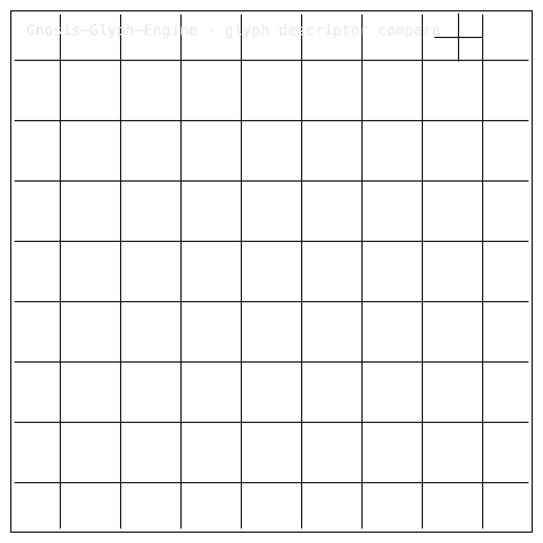

# Glyph-Engine

## Install / Developer Commands

#### Quick Start

```bash
git clone https://github.com/Zer0pa/Glyph-Engine.git
cd Glyph-Engine
python3.13 -m venv .venv && source .venv/bin/activate
pip install -e .[dev]
pytest -q                          # → 16 passed, 1 skipped
python -m gnosis_glyph_engine.scripts.run_ablation
python -m gnosis_glyph_engine.scripts.run_robustness
```

Console scripts (after install): `glyph-engine-ablation`,
`glyph-engine-robustness`.

<table width="100%">
<tr>
<td width="100%" valign="top">
<div><span><b>00 · GNOSIS-GLYPH-ENGINE</b> · ANCIENT SCRIPT GEOMETRY</span> <span>RESEARCH-READY · OWNED ARM UNTESTED</span></div>
      <h1>Ancient Script Geometry, <span>Symbolic Shape Analysis</span></h1>
      <p>Shape-only descriptor research for ancient script &middot; Gnosis-Glyph-Engine &middot; gnosis-glyph-engine <em>v0.1.0a1</em> &middot; github.com/Zer0pa/Glyph-Engine</p>
      <p>Ancient inscriptions carry geometry that no one has counted at the level of a single mark. Glyph-Engine runs three off-the-shelf shape algorithms — <strong>ORB, Hu regionprops, and HOG</strong> — across a 12-glyph fixture, ten seeds deep, and reports how steady each one is. HOG is the steadiest at sigma 1.15. Re-running with the same seed gives the same numbers, bit for bit. The page does not claim to read or decipher the marks, and the in-house descriptor stays UNTESTED until two missing Indus source files are recovered.</p>
</td>
</tr>
</table>

<table width="100%">
<tr>
<td width="100%" valign="top">
<figure>
        <div></div>
        <figcaption><b>Scope:</b> ORB, Hu, and HOG descriptor comparison. HOG is steadiest in fixtures; owned descriptor waits on missing Indus files.</figcaption>
      </figure>
</td>
</tr>
</table>

<table width="100%">
<tr>
<td width="100%" valign="top">
<div><b>01 · THE GAP</b> <span>READING VS MEASURING</span></div>
      <h2>Paleography has names for ancient marks but no shared numbers for their shape. Glyph-Engine measures the shape without claiming to read it.</h2>
</td>
</tr>
</table>

<table width="100%">
<tr>
<td width="100%" valign="top">
<div><b>02 · MARKETS</b> <span>ADJACENT FORECASTS</span></div>
      <div>
        <div>
          <div><span>Computer vision software</span>  <span>'31 · $45.9B</span></div>
          <div><span>OCR software</span>  <span>'30 · $22.4B</span></div>
          <div><span>Document AI</span>  <span>'30 · $17.2B</span></div>
          <div><span>Heritage digitization</span>  <span>'30 · $8.1B</span></div>
          <div><span>Digital humanities</span>  <span>'30 · $3.2B</span></div>
        </div>
      </div>
      <div>Adjacent markets run on shape recognition; ancient-script geometry is the narrow, mostly unpriced corner inside them.</div>
</td>
</tr>
</table>

<table width="100%">
<tr>
<td width="50%" valign="top">
<div><b>03 · VALUE</b></div>
      <div>$8.1<span>B</span></div>
      <div>Heritage digitization '30 — the funded market where ancient-mark geometry becomes usable scholarly evidence.</div>
</td>
<td width="50%" valign="top">
<div><b>04 · INSIGHT</b></div>
      <h2>Ancient marks have a shape. <span>Now it can be counted.</span></h2>
</td>
</tr>
</table>

<table width="100%">
<tr>
<td width="50%" valign="top">
<div><b>05.1 · CURRENT TECH</b> <span>DESCRIBED, NOT MEASURED</span></div>
        <p>Epigraphers and paleographers describe ancient marks by sign name, period, or catalogue entry. No common tool reports the geometry of the stroke itself, so visual arguments rest on prose and plates, not on numbers.</p>
</td>
<td width="50%" valign="top">
<div><b>05.2 · OUR TECH</b> <span>GEOMETRY MEASUREMENT FIRST</span></div>
        <p>Glyph-Engine puts numbers on shape and reports how steady each number is. Three off-the-shelf algorithms — <strong>ORB, Hu regionprops, and HOG</strong> — run ten-seed sweeps over a 12-glyph synthetic fixture, with HOG at <strong>sigma 1.15</strong> the steadiest. The same fixture and seeds are shared with the sibling Morph-Bench project. The in-house descriptor is not yet running, and nothing on this page claims to read a mark.</p>
</td>
</tr>
</table>

<table width="100%">
<tr>
<td width="100%" valign="top">
<div><b>05.3 · BENCHMARKS</b> <span>BORROWED-ARM RESULTS</span></div>
      <div>
        <div>
          <div><span>ORB &sigma;</span><b>4.14</b><small>10-seed mean</small></div>
          <div><span>Hu &sigma;</span><b>2.95</b><small>10-seed mean</small></div>
          <div><span>HOG &sigma;</span><b>1.15</b><small>most stable</small></div>
          <div><span>Tests</span><b>17/17</b><small>with sibling</small></div>
        </div>
        <div>
          <div><span>HOG &sigma;</span>  <span>1.15</span></div>
          <div><span>Hu &sigma;</span>  <span>2.95</span></div>
          <div><span>ORB &sigma;</span>  <span>4.14</span></div>
        </div>
      </div>
      <div><b>Status:</b> The three off-the-shelf algorithms have numbers; the in-house descriptor is UNTESTED until two missing Indus source files are recovered.</div>
</td>
</tr>
</table>

<table width="100%">
<tr>
<td width="34%" valign="top">
<div><b>06 · MEASUREMENT</b> <span>BORROWED-ARM SIGMA</span></div>
      <h2>Three off-the-shelf shape algorithms read the 12-glyph fixture. <span>The in-house descriptor is not running yet.</span></h2>
</td>
<td width="66%" valign="top">
<div><b>06.1 · COMPARATIVE PERFORMANCE · 10-SEED SIGMA</b></div>
      <div>
        <div>
          <div><span>HOG (borrowed)</span>  <span>&sigma; 1.15 &middot; most stable</span></div>
          <div><span>Hu regionprops (borrowed)</span>  <span>&sigma; 2.95</span></div>
          <div><span>OpenCV ORB (borrowed)</span>  <span>&sigma; 4.14</span></div>
          <div><span>Owned descriptor</span>  <span>UNTESTED &middot; D-06 unblocks</span></div>
        </div>
      </div>
      <div>10-seed &sigma; mean across borrowed ORB, Hu regionprops, and HOG over the 12-glyph synthetic fixture; <em>lower &sigma; means a more stable shape number</em>. The owned descriptor has no number yet.</div>
</td>
</tr>
</table>

<table width="100%">
<tr>
<td width="100%" valign="top">
<div><b>07 · KEY METRICS</b> <span>MEASURED RESULTS</span></div>
</td>
</tr>
</table>

<table width="100%">
<tr>
<td width="100%" valign="top">
<div><b>07.1 · ORB ROBUSTNESS &Sigma;</b></div>
      <div>4.14</div>
      <div>10-seed mean &middot; <b>borrowed OpenCV ORB</b></div>
</td>
</tr>
</table>

<table width="100%">
<tr>
<td width="100%" valign="top">
<div><b>07.2 · HU REGIONPROPS &Sigma;</b></div>
      <div>2.95</div>
      <div>10-seed mean &middot; <b>borrowed scikit-image regionprops</b></div>
</td>
</tr>
</table>

<table width="100%">
<tr>
<td width="100%" valign="top">
<div><b>07.3 · HOG ROBUSTNESS &Sigma;</b></div>
      <div>1.15</div>
      <div>10-seed mean &middot; <b>steadiest borrowed arm</b></div>
</td>
</tr>
</table>

<table width="100%">
<tr>
<td width="100%" valign="top">
<div><b>07.4 · PYTEST SURFACE</b></div>
      <div>17<span>/17</span></div>
      <div>17 pass with sibling &middot; <b>16 pass plus 1 skip without it</b></div>
</td>
</tr>
</table>

<table width="100%">
<tr>
<td width="100%" valign="top">
<div><b>07.5 · OWNED DESCRIPTOR &Sigma;</b></div>
      <div>null</div>
      <div>Owned descriptor pending &middot; <b>D-06 is the unblock</b></div>
</td>
</tr>
</table>

<table width="100%">
<tr>
<td width="100%" valign="top">
<div><b>08 · DETERMINISM</b> <span>PER-ARM REPLAY</span></div>
      <h2>Seed-42 replay is per borrowed arm, <span>not owned arms.</span></h2>
</td>
</tr>
</table>

<table width="100%">
<tr>
<td width="66%" valign="top">
<div><b>08.1 · WHAT DETERMINISM MEANS</b> <span>BORROWED BASELINES ONLY</span></div>
      <p>At seed 42, each borrowed ORB, Hu regionprops, and HOG arm replays identically: <code>replay_all_identical == true</code>. The <strong>reference-freeze SHA-256 is byte-stable</strong> across the declared 12-glyph fixture. The same fixture produces the same numbers, every run.</p>
      <p>That does not prove owned descriptors, real glyphs, or arbitrary scripts. The unit of bit-exactness is <em>per-arm, per-seed, borrowed baselines only</em>. Shape measurement without determinism is anecdote; determinism is the thin floor under everything else here.</p>
</td>
<td width="34%" valign="top">
<div><b>08.2 · HONEST BLOCKER</b></div>
      <span>Honest Blocker &middot;</span>
      <p><code>package_boundary_earned</code> is <em>UNTESTED</em>. PyPI <code>0.1.0a1</code> is a public alpha with incomplete metadata. D-06 must retrieve <code>scripts/indus/stroke_native_encoding.py</code> and <code>phase3_common.py</code> before owned arms run. <strong>Claims stop at borrowed-baseline receipts: no release, no owned encoder, no production engine, no script understanding.</strong></p>
</td>
</tr>
</table>

<table width="100%">
<tr>
<td width="33%" valign="top">
<div><b>09</b> </div>
      <h2>MARKS WITH A <span>MEASURED SHAPE.</span></h2>
</td>
<td width="67%" valign="top">
<div><b>09.1 · THIS REPO'S AMBITION</b></div>
      <p>Glyph-Engine wants ancient-mark geometry to become an evidence layer that heritage researchers, paleographers, and decipherment specialists can share. The ambition is a shape vocabulary that travels between archives and journals without smuggling in a reading, so the conversation about what the marks mean can rest on what they actually look like.</p>
</td>
</tr>
</table>

<table width="100%">
<tr>
<td width="33%" valign="top">
<div><b>09.2 · WHAT WORKS NOW</b></div>
        <h2>Three borrowed shape arms produce stable, bit-identical numbers over a declared <span>12-glyph fixture today.</span></h2>
</td>
<td width="67%" valign="top">
<div><b>09.3 · WHAT'S STILL OPEN</b></div>
        <h2>The owned descriptor and a real-glyph corpus stay UNTESTED <span>until D-06 retrieves the missing Indus files.</span></h2>
</td>
</tr>
</table>

<table width="100%">
<tr>
<td width="100%" valign="top">
<div><b>09.4</b> &middot; ARCHIVES · NEAR-TERM (12–24 MO)</div>
      <div>Heritage archives sort marks by shape</div><div>A heritage archive curator can group thousands of unread marks by geometric similarity instead of cataloguer notes. The same descriptor numbers travel between corpora, so sorting decisions are reviewable by anyone, not stuck in one institution's house style.</div>
</td>
</tr>
</table>

<table width="100%">
<tr>
<td width="100%" valign="top">
<div><b>09.5</b> &middot; SCHOLARSHIP · NEAR-TERM (12–24 MO)</div>
      <div>Paleographers gain a measurement vocabulary</div><div>A paleographer publishing a stroke-form argument can attach a sigma figure to the visual claim. Reviewers can re-run the descriptors against their own corpus and disagree on numbers instead of impressions, which moves epigraphic debate onto firmer ground.</div>
</td>
</tr>
</table>

<table width="100%">
<tr>
<td width="100%" valign="top">
<div><b>09.6</b> &middot; DECIPHERMENT DISCIPLINE · MID-TERM (24–48 MO)</div>
      <div>Shape and meaning stay separated</div><div>Script-decipherment specialists working on contested scripts get a reusable shape layer that refuses to encode a reading. That keeps speculative translations from quietly leaking into descriptor metadata, which is how earlier decipherment programmes contaminated the evidence they were trying to weigh.</div>
</td>
</tr>
</table>

<table width="100%">
<tr>
<td width="100%" valign="top">
<div><b>09.7</b> &middot; TOOLING · MID-TERM (24–48 MO)</div>
      <div>Digital humanities tools share one floor</div><div>A digital-humanities lab adopting Glyph-Engine baselines as a common floor can compare its custom descriptors against three well-understood arms before publishing a kernel. Comparison becomes the first step, not the last, so weak descriptors are caught before they reach a manuscript.</div>
</td>
</tr>
</table>

<table width="100%">
<tr>
<td width="100%" valign="top">
<div><b>09.8</b> &middot; METHOD · PARADIGM (48 MO+)</div>
      <div>Geometry travels across heritage domains</div><div>A descriptor kernel that earns its independent boundary can move beyond ancient script into seals, pottery marks, textile motifs, and rock art. The portable object is the measurement method itself, which is what changes how heritage research builds reusable evidence.</div>
</td>
</tr>
</table>
